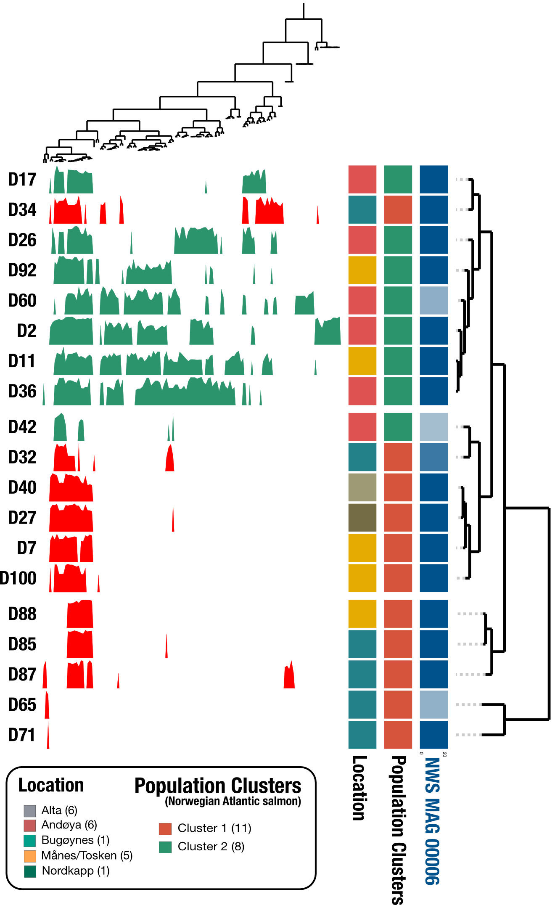

# Hologenomics reveal co-evolution of an intestinal Mycoplasma and its salmonid host
This Github repository includes the analytical framework to generate results that are reported in Rasmunssen et al. 2022 (unpublished) and are central to its main claims.

#Analytical Background

• For a more evolutionary perspective, we investigated SNVs, SCVs, and SAAVs of NWS_MAG_00006 (aka. *Candidatus* Mycoplasma salmoninae salar), following the wonderful anvi’o guidelines
    - SNVs were used to investigate potential mutations being related to host genotype (actual hologenomics)
    - SCVs were applied for pNpS inferring to look for gene wise selection pressure
    - SAAVs were used to investigate fixated mutations in the amino acid composition within populations of metagenomes

• SAAVs were used to make a prevalence analysis across host genotypes within Norwegian individuals
    - SAAVs were analysed in concordance with predicted protein structures used for SNV analysis

## Analysis

**First of all - I’m a massive anvi’o fanboy, thank you so much for the amazing platform**
All of these analyses have been made through anvi’o, since it works smoothly and are super user friendly,
so if you don’t used anvi’o yet, then get sh*t together and use it:+1::kissing_heart:!

### SNV Analysis
So... I will not take any credit (only that i followed their tutorial, without major f*ckups),
please find anvio tutorial about population genetics in metagenomes by Meren lab, highly recommended:
https://merenlab.org/2015/07/20/analyzing-variability/#matrix-output-those-unique-to-saavs

```
# This was done within NWS_MAG_00006 splitted databases, therefore the collection and bin name were in concordance with the other bin names
anvi-gen-variability-profile -c CONTIGS.db \
                             -p PROFILE.db \
                             -C DEFAULT \
                             -b Mycoplasma \
                             --samples-of-interest soi_CL1.txt \
                             --min-occurrence $((19*90/100)) \
                             --include-split-names \
                             --quince-mode \
                             -o NWS_MAG_00006-CL1-SNVs_90p.txt

# I like to use the anvio interface, especially for the discovery phase, some things is difficult within the interface, but this is super smooth!
anvi-script-snvs-to-interactive NWS_MAG_00006-SNVs.txt -o NWS_CL1_SNVs_90p

#

anvi-interactive --profile NWS_CL1_SNVs_90p/profile.db \
                 --tree NWS_CL1_SNVs_90p/tree.txt \
                 --view-data NWS_CL1_SNVs_90p/view.txt \
                 --title "SNV Profile for the MSS bin" \
                 --manual

# Add host genotype information for the 19 samples
anvi-import-misc-data CL1_view.txt -p PROFILE.db --target-data-table layers --just-do-it

# Here you go!                  
```

With a bit of brush up in Inkscape or Affinity, voila!




### SCV Analysis - pNpS inferring
To get reproduce the pNpS data for NWS_MAG_00006 you need to run the following commands, else find pNpS data in the repo :+1:
```
anvi-gen-variability-profile -c CONTIGS.db \
                             -p PROFILE.db \
                             --samples-of-interest samples_of_interest.txt \
                             --engine CDN \
                             --collection-name DEFAULT \
                             --bin-id Mycoplasma \
                             --include-site-pnps \
                             --kiefl-mode \
                             -o NWS_SCVs.txt

#
anvi-get-pn-ps-ratio -V NWS_SCVs.txt \
                     -c CONTIGS.db \
                     --min-departure-from-consensus 0.04 \
                     --min-coverage 20 \
                     --minimum-num-variants 10 \
                     --comparison popular_consensus \
                     --pivot \
                     -o NWS_pNpS
```
