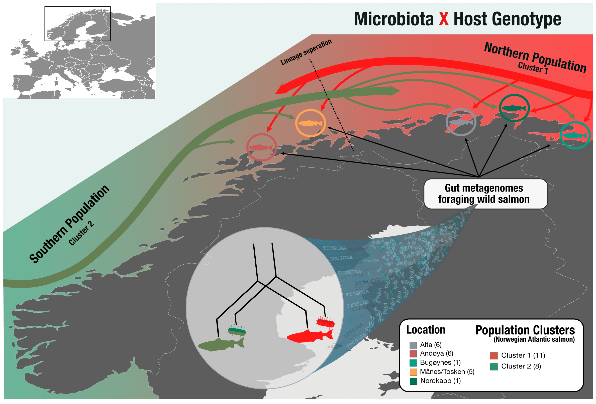

# Hologenomics reveal co-evolution of an intestinal Mycoplasma and its salmonid host

This Github repository includes the analytical framework to generate results that are reported in Rasmunssen et al. 2022 (unpublished) and are central to its main claims.

**Background**

The gut microbiota is shaped by a vast blend of environmental and evolutionary processes within the intestinal environment of its host. How these evolutionary processes occur in wild animals remain still highly unexploited, due to high complexity of the environment and microbiota. Therefore, new wild model organisms with low complex microbiota and known population structures could be key to investigate co evolution between the microbiota and their host.

**Results**

Through our investigations we hereby present the first genome catalogue from wild Atlantic salmon (*Salmo salar*) derived from more than 70 wild adult foraging salmon. Despite the high variation in location, diet, stomach content, size, sex, and presence of endoparasites between individuals, very low variation of the gut microbiota were found. The recovered gut microbiota were found of low complexity and mainly dominated by the salmonid related Mycoplasma (*Candidatus* Mycoplasma salmoninae salar), which were found highly host-specific, indicating a strong selection pressure of the gut microbiota by Atlantic salmon. Interestingly, we found a high concordance between the population structure of Atlantic salmon and the nucleotide variability of *Candidatus* Mycoplasma salmoninae salar, clearly suggesting co-evolution.

**Conclusion**

Investigations of the coevolution of host and microbiota in Atlantic salmon will lead to a higher understanding of the interactions from both actors. It is clear from our results that the microbiota from Atlantic salmon has adapted to the population structure through a close relationship between its genome and gut microbiome, showing that Atlantic salmon can be a suitable model for studying host-microbiome coevolution.

## Bioinformatics
• All underlying repositories includes a walk through of bioinformatic code and descriptions to increase reproducibility

## Analysis
• All underlying repositories includes datasets needed for result generation and a respective R markdown file.
